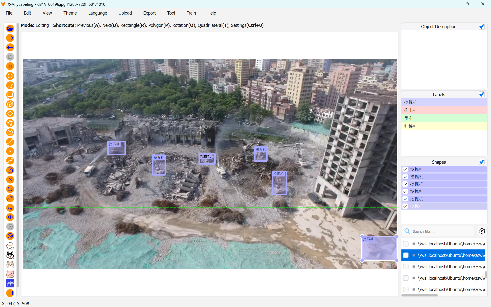

<div align="center">
  <p>
    <a href="https://github.com/laimingguang/X-AnyLabeling-WSL/" target="_blank">
      </a>
  </p>

[English](README.md) | [简体中文](README_zh-CN.md)

</div>

# WSL-Enhanced X-AnyLabeling

[CVHub520/X-AnyLabeling](https://github.com/CVHub520/X-AnyLabeling) 的一个 fork，修复了 Windows 原生文件夹选择弹窗中 WSL2 目录不可见的问题。

## 背景

在 WSL2 中进行深度学习训练是 Windows 机器学习工程师的常规做法——CUDA GPU-PV、ext4 文件系统、训练框架均原生支持。

GUI 侧存在一个已知的权衡。WSLG（WSL GUI）由于基于 RDP 的渲染管线，在高 DPI 屏幕上会出现明显模糊。上游作者已明确建议在 Windows 原生环境运行 X-AnyLabeling，而非 WSLG 内部（[#811](https://github.com/CVHub520/X-AnyLabeling/issues/811)）。

## 问题

在 Windows 原生运行 X-AnyLabeling 时，标准文件夹选择弹窗会隐藏 `\\wsl.localhost` 及其所有子目录。这不是 X-AnyLabeling 或 Qt 的 bug——这是 Windows Shell API 的已知行为：`QFileDialog.getExistingDirectory` 设置了 `FOS_FORCEFILESYSTEM` 标志，该标志会压制非文件系统命名空间条目。Microsoft 已知此限制（[microsoft/WSL#9079](https://github.com/microsoft/WSL/issues/9079)，2021 年起开放至今）。

## 修复

从对话框选项中移除 `FOS_FORCEFILESYSTEM` 标志。WSL Linux 节点自然出现在侧边栏中——同一对话框、同一行为、无额外依赖。

JetBrains 全系 IDE（IntelliJ、PyCharm 等）使用同一方案（[JBR PR #497](https://github.com/JetBrains/JetBrainsRuntime/pull/497)）。

## 影响范围

应用中所有文件夹选择弹窗现已统一使用现代 Windows 原生对话框。此前 8 处使用原生弹窗（但无 WSL 支持），13 处使用 Qt 自定义弹窗——两者风格割裂。现在全部 21 处统一为同一原生实现：

| 弹窗 | 位置 | 原实现 |
|------|------|--------|
| 打开目录 / 更改输出目录 / 对比视图 | 标注主界面 | 原生 |
| CSV 导出 / AI 聊天导出 / 分类导出 / 视频分类输出 | 各对话框 | 原生 |
| 训练数据集（分类任务） | 训练对话框 | 原生 |
| YOLO 导入（全部格式） | 上传对话框 | **Qt 自渲染** |
| 导出（全部格式） | 导出对话框 | **Qt 自渲染** |
| 裁剪保存目录 | 裁剪对话框 | **Qt 自渲染** |

结果：整个应用统一的现代原生对话框体验，不再有 Qt 自定义弹窗与 Windows 系统弹窗混杂的割裂感。

## 对非 WSL 用户的影响

无行为变化，但你会看到所有文件夹选择弹窗统一为 Windows 原生风格，不再是 Qt 自定义与原生混杂。Linux 和 macOS 运行标准 `QFileDialog.getExistingDirectory`——与上游完全一致。

## 安装

```bash
git clone https://github.com/laimingguang/X-AnyLabeling-WSL.git
cd X-AnyLabeling
uv tool install --editable .
python anylabeling/app.py
```

## 与原版的关系

除文件夹选择器修复外，其余部分与原始仓库完全一致。同步上游：

```bash
git remote add upstream https://github.com/CVHub520/X-AnyLabeling.git
git fetch upstream
git rebase upstream/main
```

## 许可证

[GPL-3.0](./LICENSE)

## 字体

应用默认字体已切换为 **JetBrains Mono**，一款清晰易读的开发者字体，在标注标签、置信度分数和 UI 文本上有更出色的可读性。



仅需在 `app.py` 中添加一行代码即可实现字体切换——若系统中未安装该字体，Qt 会自动回退到系统默认字体。
