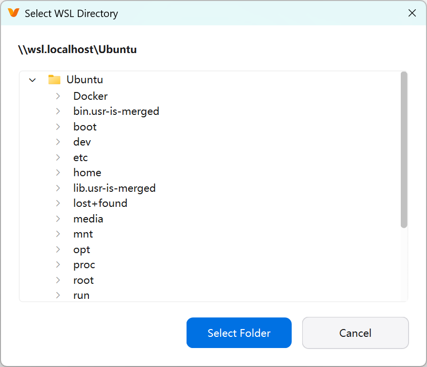

<div align="center">
  <p>
    <a href="https://github.com/laimingguang/X-AnyLabeling-WSL/" target="_blank">
      </a>
  </p>

[简体中文](README_zh-CN.md) | [English](README.md)

</div>

# WSL-Enhanced X-AnyLabeling

这是 [CVHub520/X-AnyLabeling](https://github.com/CVHub520/X-AnyLabeling) 的一个 fork，唯一增加的功能是：**在 Windows 上原生浏览 WSL2 数据集目录**。如果你用 WSL2 做深度学习、但希望在 Windows 原生环境下享受清晰的高分屏 GUI 体验，这个 fork 就是为此而生。

---

## 问题

**WSL2** 是 Windows 上深度学习的主流运行环境。它提供真实的 Linux 内核、原生 NVIDIA CUDA GPU-PV 支持（可直接访问 `/dev/nvidia*`）、全速 ext4 文件系统，与训练框架无缝集成。用户自然会在 WSL2/Ubuntu 中运行训练、数据预处理和模型推理。

但对于 **GUI 工具（如 X-AnyLabeling）**，**WSLG** 的高分屏体验存在根本性缺陷。WSLG 内部基于 RDP 远程渲染管线：`Weston`（Wayland 合成器）→ `mutter`（窗口管理器）→ RDP 服务器 → Windows RDP 客户端。在非整数缩放比（>150%）的屏幕上，渲染效果模糊或出现像素倍增，不支持按显示器独立 DPI 感知，存在输入延迟，字体渲染远不如 Windows 原生 ClearType / DirectWrite。自然的解决方案是在 **Windows 原生环境**下运行 X-AnyLabeling——HiDPI、字体渲染、GPU 加速绘制均完美工作。

但这又引出第二个问题。X-AnyLabeling 的文件对话框（`QFileDialog`）底层依赖 Windows Shell API（`IFileDialog` / `IFileOpenDialog`）进行目录导航。Windows Shell 不将 `\\wsl.localhost` 视为可导航的命名空间项。虽然 WSL 网络提供程序（`wslfs.sys` + `wsl.exe`）在 Win32 API 层以 UNC 路径形式将其暴露，但 Qt 的 Shell 集成无法枚举或进入该路径。常见的变通方案——通过 `net use` 将 `\\wsl.localhost\Ubuntu\home\...` 映射为网络驱动器——操作繁琐、重启后失效、用户体验差。

简而言之：你必须在 **好的显示效果**（Windows 原生 GUI）和 **访问 WSL 数据集**（在 WSL 内部运行）之间二选一。直到现在。

## 解决方案

检测到 Windows 上存在 WSL 时，本 fork 将系统目录选择对话框透明替换为自定义的 `WslDirectoryPicker(QDialog)`，彻底绕过 Windows Shell 层——目前已支持打开文件夹、更改输出目录、对比视图和分类数据集目录选择：


对于没有 WSL 的用户（Linux、macOS、未安装 WSL 的 Windows），本 fork 的行为与上游完全一致——文件对话框会检测 WSL 是否存在，不存在则回退为标准 `QFileDialog`，零行为差异。

- **发行版枚举**：通过 `wsl -l -v` 获取列表（含版本号），以 UTF-16-LE 编码解码（`errors="replace"`）——这是 Windows 实际使用的输出编码，标准编码检测会遗漏。
- **WSL 版本过滤**：仅显示 WSL2 发行版（`\\wsl.localhost` 不支持 WSL1）。解析 `wsl -l -v` 输出中的版本列，过滤掉非版本 2 的发行版。
- **用户发行版过滤**：仅显示 `/home` 目录非空的发行版，辅以 `"docker"` 名称检查作为兜底。以此隐藏 docker-desktop 等非用户环境。
- **延迟加载树形导航**：直接用 Python 的 `os.listdir` 遍历目录——`os.listdir` 在 `\\wsl.localhost\Ubuntu\home\...` 上完全正常，即使 Windows Shell 无法导航进去。每个目录在首次展开时加载，加载结果缓存在 `_loaded` 集合中。
- **健壮的错误处理**：所有 `os.listdir` 抛出的 `OSError` 异常均被捕获（`\\wsl.localhost` 根目录的 WinError 64、保护目录的权限错误等）。
- **零额外依赖**：纯逻辑层（`utils/wsl.py`）仅导入标准库模块（`os`、`os.path`、`subprocess`）；Qt 对话框层（`label_widget.py`）只使用项目中已有的 PyQt6 控件。

最终效果是无缝的：**Windows 原生界面品质 + 完整 WSL 文件系统访问**，零配置，无需任何变通方案。



## 安装

```bash
git clone https://github.com/laimingguang/X-AnyLabeling-WSL.git
cd X-AnyLabeling
uv tool install --editable .
```

运行测试：

```bash
uv tool install --editable . --with pytest
& "$env:USERPROFILE\AppData\Roaming\uv\tools\x-anylabeling-cvhub\Scripts\pytest.exe" tests\test_wsl_picker.py -v
```

## 与上游的关系

除 WSL 目录选择器外，所有功能与原版完全一致。与上游保持同步：

```bash
git remote add upstream https://github.com/CVHub520/X-AnyLabeling.git
git fetch upstream
git rebase upstream/main
git push --force-with-lease
```

## 许可

[GPL-3.0](./LICENSE)
